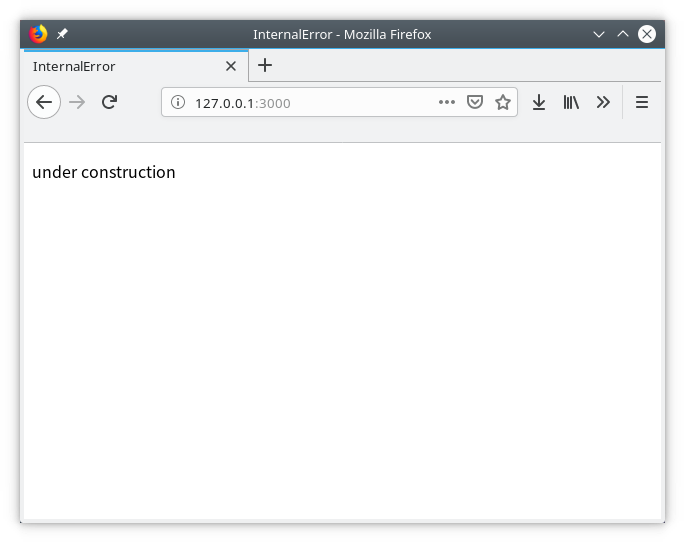

# Day 1: Under Construction

## Goal

Build a notice page, saying the site is under construction.

## Setup Tooling

1. register an account at [LeanCloud] and create a new app called `internalerror`
2. install [lean-cli]
3. login via `lean login --region us`
4. initialize a new project: `lean init --region us`, select `internalerror` app and Node.js environment with express template

[LeanCloud]: https://us.leancloud.cn
[lean-cli]: https://us.leancloud.cn/docs/leanengine_cli.html

Now I have a project directory named `internalerror` under the current working directory.
The directory structure is same as a normal express project, except for:

1. Files specified in `.leanignore` will not be uploaded to cloud. Its syntax is a subset of `.gitignore`.
2. `.leancloud` directory contains meta information about LeanCloud app, e.g. app id.

Run the following command to preview the default demo project:

```sh
npm install
lean up
```

I am lazy, so I just edited `views/index.ejs`:

```html
<!DOCTYPE HTML>
<html>
  <head>
    <title>InternalError</title>
  </head>
  <body>
    <p>under construction</p>
  </body>
</html>
```

