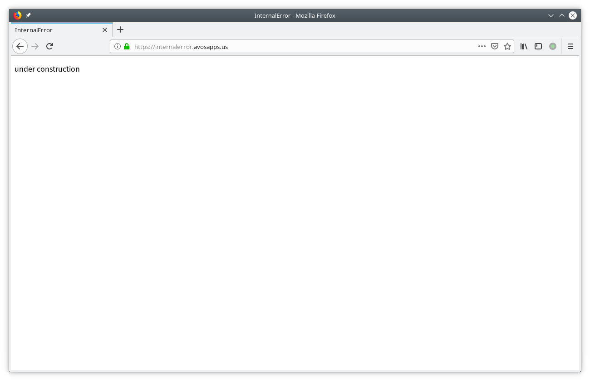

# Day 2: Deploy

## Goal

Deploy it to LeanEngine.

## First Deployment

In Dashboard > LeanEngine > Settings > Web Hosting Domain,
I set it to *internalerror*.
Then I run `lean deploy` to deploy the project.
After the deployment, I can access the site at
<https://internalerror.avosapps.us/>

